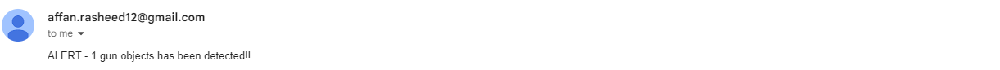

## Installation
1. Install [ultralytics](https://docs.ultralytics.com/quickstart/)
## Gun Detector Model
For generating gun detection model, yolov8n model is fine tune on custom dataset. The model details is [here.](https://github.com/affanrasheed/Gun-Detector-Yolov8/tree/main/Training_Testing)

## Gun Security Email Explanation
1. Setup [App Password Generator](https://myaccount.google.com/apppasswords)
2. Replace password, from_email and to_email inside the code
3. Download gun detector model
4. Capture input video using opencv by setting the PATH variable
5. Run gun detector model on each captured frame
6. Detect the gun and send alert on an email
   

## Output Results

complete video
[Test Video for Gun Detection](https://drive.google.com/file/d/197TlmMYN8QwHZkrNhfRpAqkB3DUdOLBO/view?usp=sharing)

