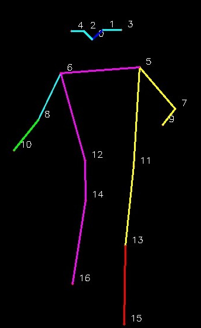

## Installation
1. Install [ultralytics](https://docs.ultralytics.com/quickstart/)

## Workout Monitor Explanation
In this tutorial, a pretrained yolov8n-pose model will be used to calculate the pose keypoints and using the keypoint calculate the number of repition for an exercise.
The keypoints of the pose are use to calculate repetition of each exercise. The keypoints use for Pushups and Pullups are [6,8,10] as 

We will be testing three exercises
### 1. Pushups
Keypoint use in this exercise are [6,8,11]. The angle between vector from point 6 to 8 and vector from point 8 to 11 helps to calculate the repetition or steps. The angle threshold is set to 145 degrees and 90 degrees.
### 2. Pullups
Keypoint use in this exercise are [6,8,11]. The angle between vector from point 6 to 8 and vector from point 8 to 11 helps to calculate the repetition or steps. The angle threshold is set to 145 degrees and 90 degrees.
### 3. Squats
Keypoint use in this exercise are [12,14,16]. The angle between vector from point 12 to 14 and vector from point 14 to 16 helps to calculate the repetition or steps. The angle threshold is set to 145 degrees and 95 degrees.

## Running Instruction
1. Change source to a valid video path
2. Select the required keypoint
3. Set the pose_up_angle and pose_down_angle threshold
4. run workout_monitor.py
   
## Output Results
### For Pushups
[Test Video for Pushup](https://drive.google.com/file/d/1quGKTcTT-SqDM5i7gScAMOl7_-RPiPW_/view?usp=sharing)
### For Pullups
[Test Video for Pullups](https://drive.google.com/file/d/11oK1bbtLrO_LbKhbgUHOr9z7A7XecHPq/view?usp=sharing)
### For Squats
[Test Video for Squats](https://drive.google.com/file/d/1DbUXVU0nE2_cT6mhVaq3cmuVg3murSss/view?usp=sharing)

